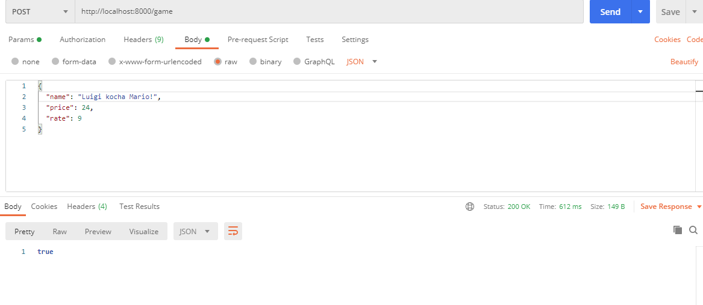

## Opis Backendu
Backend jest napisany w Pythonie w oparciu o framework Flusk.
Przed uruchomieniem stwórz wirtualne środowisko np. w Condzie komendą:

```bash
conda env create -f environment.yml
```
Uruchom wirtualne środowisko
```bash
conda activate mtp
```
Plik *main.py* jest plikiem z, które można uruchomić cały serwer wystarczy wykonać"
```bash
python3 main.py
```
### Modyfikowanie istniejącej bazy danych
Do czasu stworzenie przykładowej bazy danych będziemy korzystać z bazy danych games.db 
### Postman 
Tesotwanie api za pomocą listonosza
#### Wyświetlanie zawartości bd


#### Dodawanie pojedynczego wpisu do bazy przez zapytanie POST


